# Relational-Database-Pacmann - Used-Car-Market
### Muhammad Farid Zaki / muhammadfarid.zaki@gmail.com

# PROJECT BACKGROUNDS
Dalam project ini anda diberikan tugas untuk membangun relational database untuk sebuah website yang menawarkan penjualan mobil bekas. Gambaran umum tentang project ini adalah siapa saja dapat menawarkan produknya (mobil bekas) dalam bentuk iklan dan calon pembeli dapat melakukan pencarian berdasarkan beberapa kategori. Untuk lebih jelasnya, berikut adalah fitur serta batasan project ini:

1. Setiap user aplikasi dapat menawarkan lebih dari satu produk mobil bekasnya.
2. Sebelum menjual produk mobil, user harus melengkapi data dirinya terlebih dahulu, seperti nama, kontak, dan domisili lokasi.
3. User menawarkan produknya melalui iklan yang akan ditampilkan oleh website.
4. Iklan ini berisikan judul, detail informasi produk yang ditawarkan, serta kontak penjual.
5. Beberapa informasi yang harus ditulis dalam iklan adalah sebagai berikut
merek mobil: Toyota, Daihatsu, Honda, dll
Model: Toyota Camry, Toyota Corolla Altis, Toyota Vios,Toyota Camry Hybrid, dll
Jenis body mobil: MPV, SUV, Van, Sedan, Hatchback, dll
Tipe mobil: manual atau automatic
Tahun pembuatan mobil: 2005, 2010, 2011, 2020 
Deskripsi lain, seperti warna, jarak yang telah ditempuh, dsb,  boleh ditambahkan sesuai kebutuhan.
6. Setiap user bisa mencari mobil yg ditawarkan berdasarkan lokasi user penjual, merk mobil, dan jenis body mobil.
7. Jika calon pembeli tertarik terhadap sebuah mobil, ia dapat menawar (bid) harga produk jika penjual mengizinkan fitur tawar.
7. Transaksi pembelian dilakukan di luar aplikasi sehingga tidak dalam scope project

# DESIGNING THE DATABASE
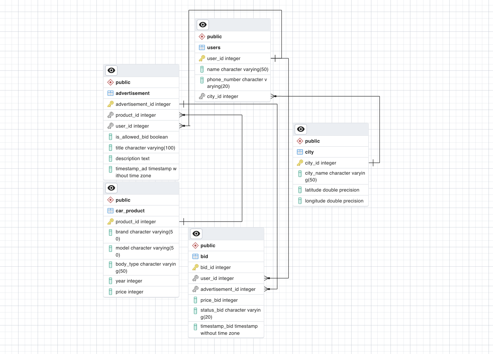

# IMPLEMENTING THE DESIGN
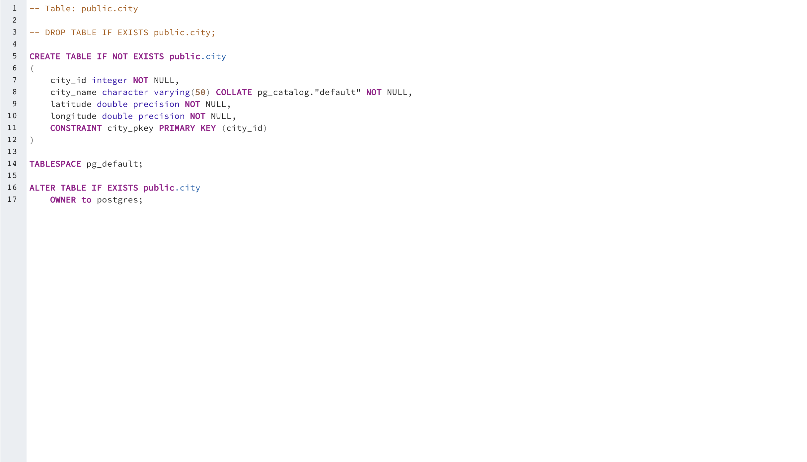
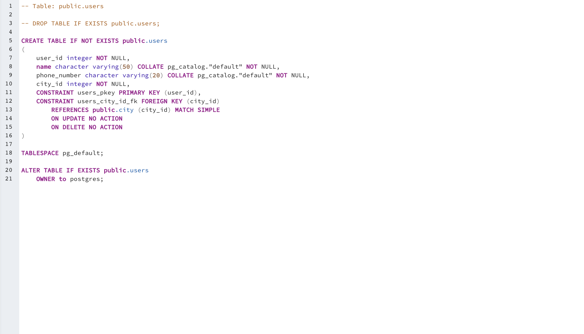
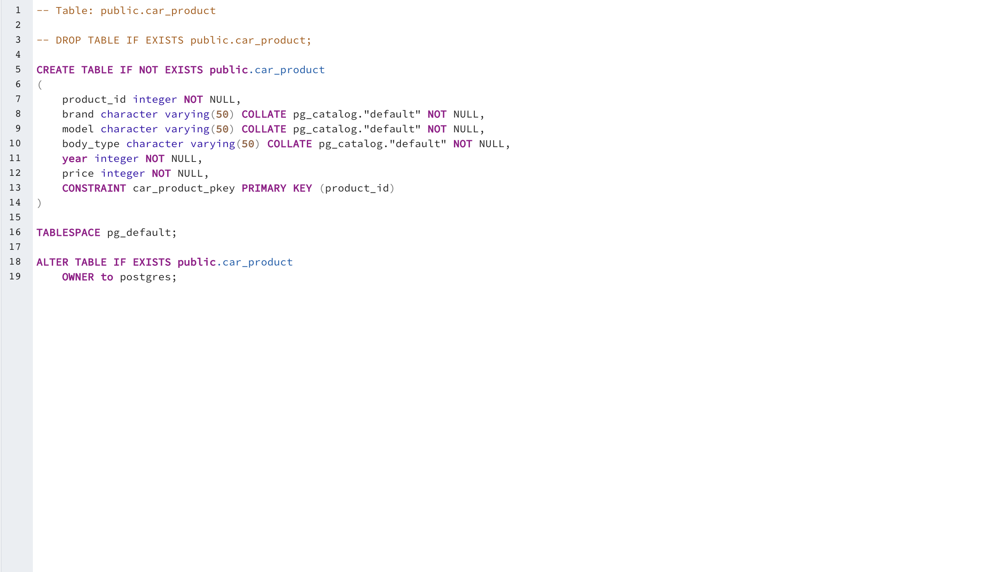
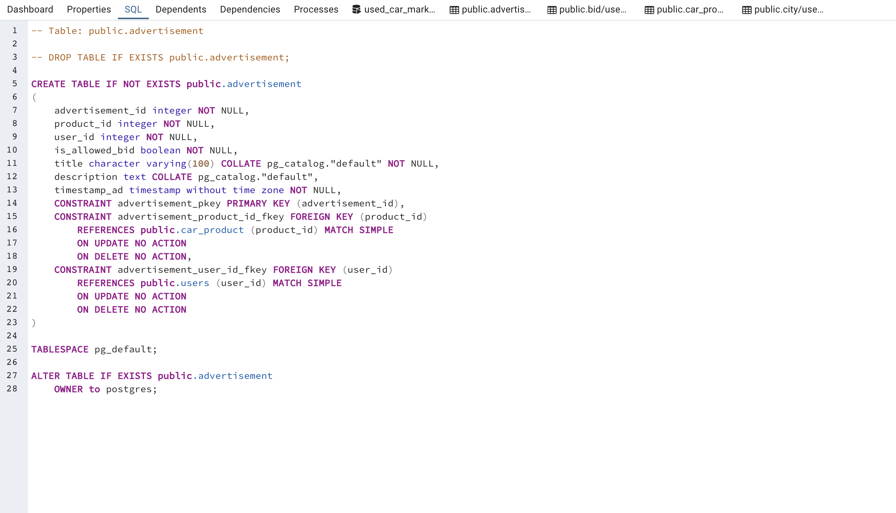
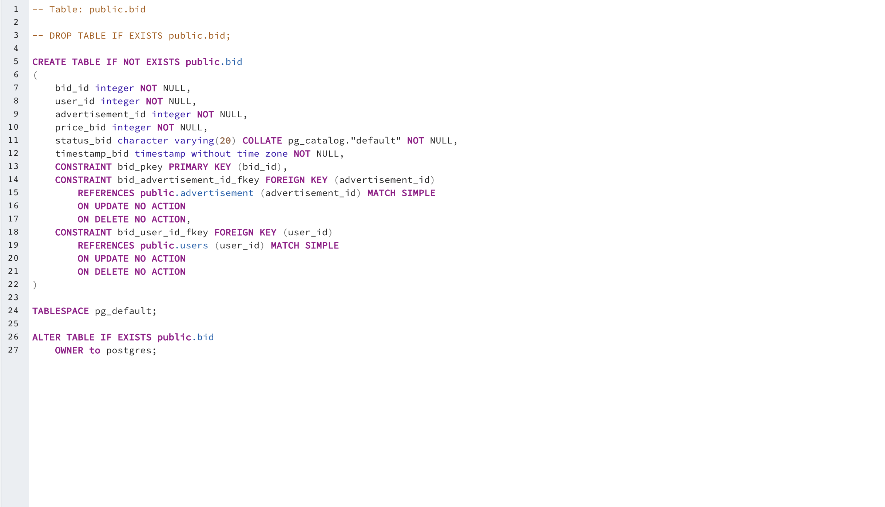

# POPULATING THE DATABASE
  ```python
  import csv
from faker import Faker
from tabulate import tabulate
import random
import os
import datetime

def create_csv(table_name, data, headers):
    # Export the table to a CSV file
    file_path = os.path.join(os.getcwd(), "dummy_files/"+table_name+".csv")
    with open(file_path, 'w', newline='') as csvfile:
        writer = csv.writer(csvfile)
        writer.writerow(headers)
        writer.writerows(data)

def csv_to_dict(file_name):
    file_path = os.path.join(os.getcwd(), file_name)
    with open(file_path, 'r', encoding='utf-8-sig') as file:
        reader = csv.DictReader(file)
        data = []
        for row in reader:
            data.append(row)
        return data

def create_users(city_table):
    # Create fake data using the Faker library
    fake = Faker('id_ID')  # Use Indonesian locale
    users = []
    for i in range(100):
        user_id=i+1
        name = fake.name()
        phone_number = fake.phone_number()
        city_id = city_table[random.randint(0, 14)]['city_id']
        users.append([user_id,name, phone_number, city_id])

    headers = ["user_id","name", "phone_number", "city_id"]
    # Use tabulate to create a table
    # table = tabulate(users, headers=headers)

    # Print the table to the console
    # print(table)
    create_csv("users",users,headers)

def create_advertisement(car_table):
    # Create fake data using the Faker library
    fake = Faker('id_ID')  # Use Indonesian locale
    advertisement = []
    for i in range(30):
        text= fake.text()
        advertisement_id=i+1
        product_id = car_table[random.randint(1, 49)]['product_id']
        user_id = random.randint(1, 100)
        is_allowed_bid=random.choice([True, False])
        title = text.rsplit()[0]
        description= text
        timestamp_ad=fake.date_time_between(start_date='-2y', end_date='now')
        advertisement.append([advertisement_id,product_id,user_id,is_allowed_bid,title,description,timestamp_ad])

    headers = ['advertisement_id','product_id','user_id','is_allowed_bid','title','description','timestamp_ad']
    # Use tabulate to create a table
    # table = tabulate(advertisement, headers=headers)

    # Print the table to the console
    # print(table)
    create_csv("advertisement",advertisement,headers)

def create_bid():
    # Create fake data using the Faker library
    fake = Faker('id_ID')  # Use Indonesian locale
    bids = []
    for i in range(100):
        bid_id=i+1
        user_id = random.randint(1, 100)
        advertisement_id=random.randint(1, 29)
        timestamp_bid=fake.date_time_between(start_date='-2y', end_date='now')
        status_bid= random.choice(["Succeed","Rejected","Pending", "Canceled"])
        price_bid=random.randint(60000000, 415000000)
        bids.append([bid_id,user_id,advertisement_id,price_bid,status_bid,timestamp_bid])

    headers = ['bid_id','user_id','advertisement_id','price_bid','status_bid','timestamp_bid']
    # Use tabulate to create a table
    # table = tabulate(bids, headers=headers)

    # Print the table to the console
    # print(table)
    create_csv("bid",bids,headers)

# create_users(csv_to_dict('dummy_files/city.csv'))
# create_advertisement(csv_to_dict('dummy_files/car_product.csv'))
create_bid()
  ```
# TRANSACTIONAL QUERY
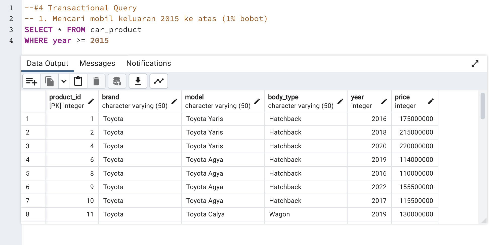
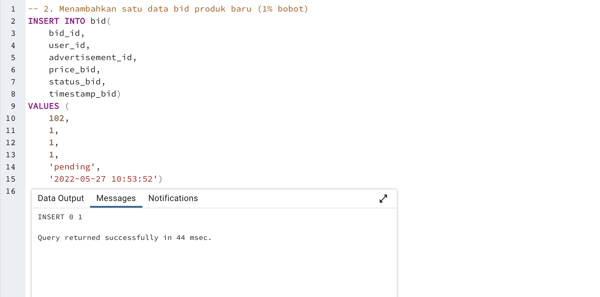
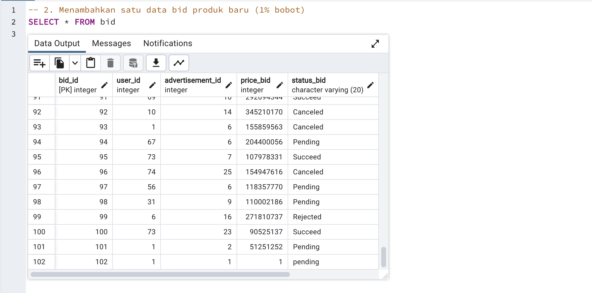
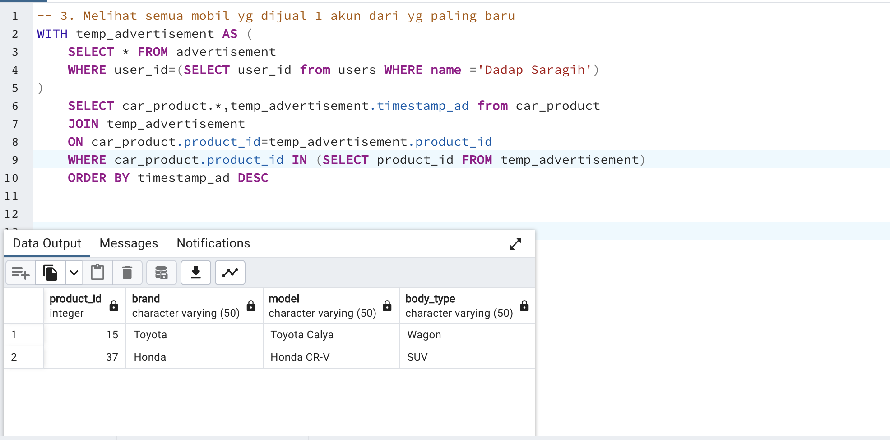
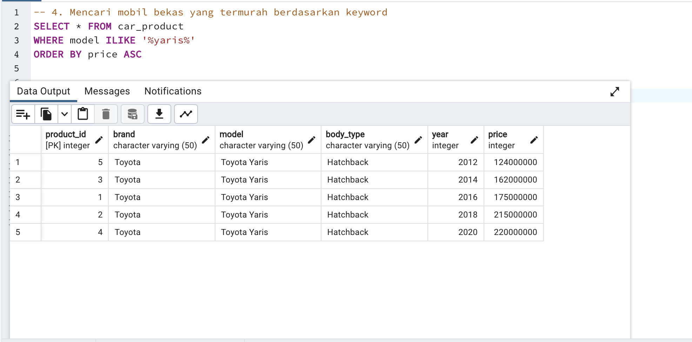
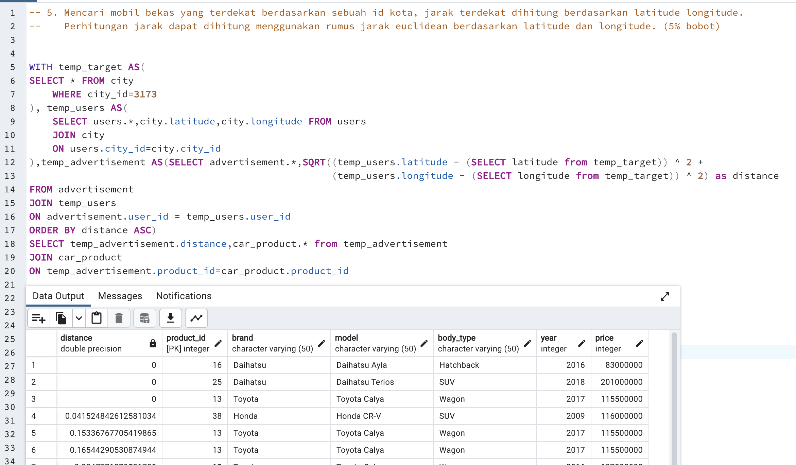

# ANALYTICAL QUERY
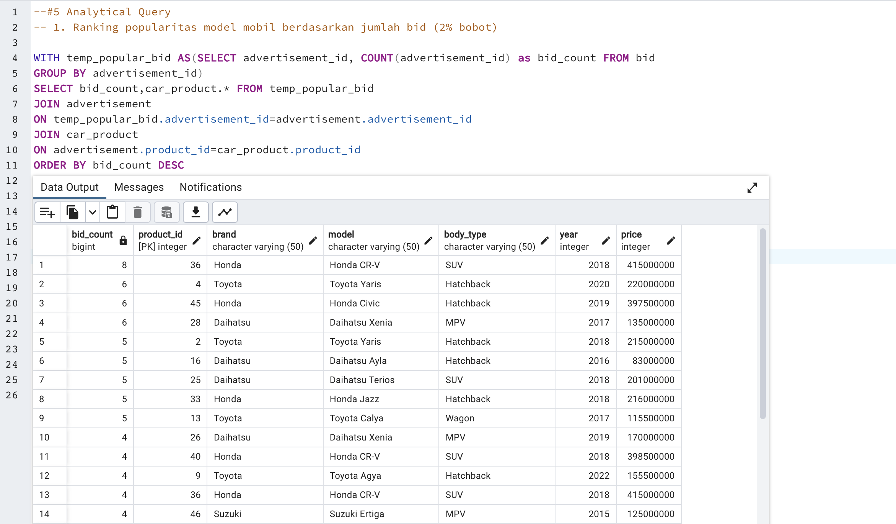
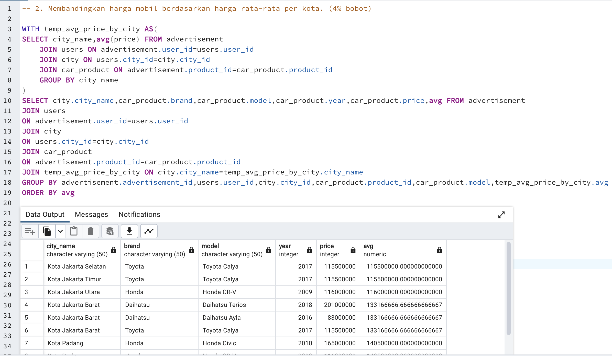
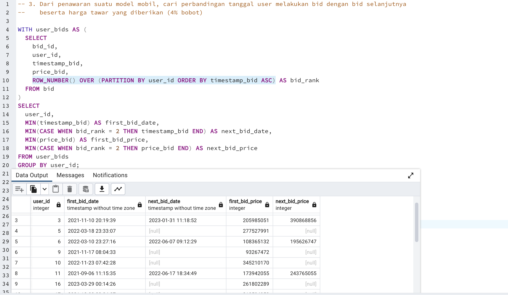
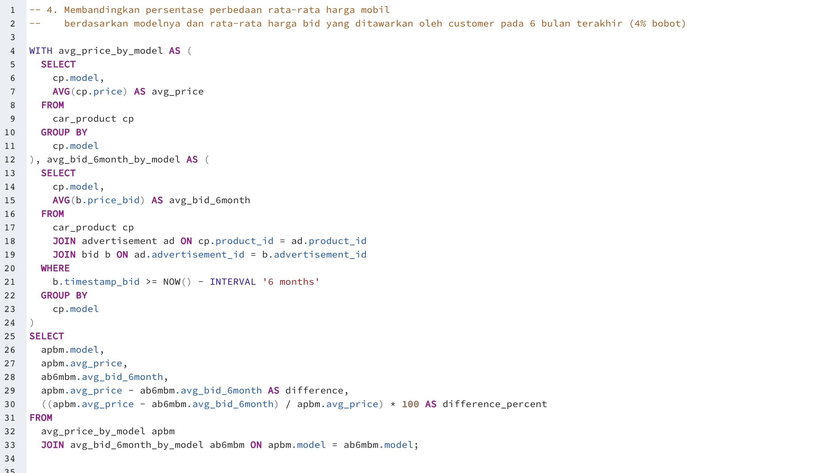
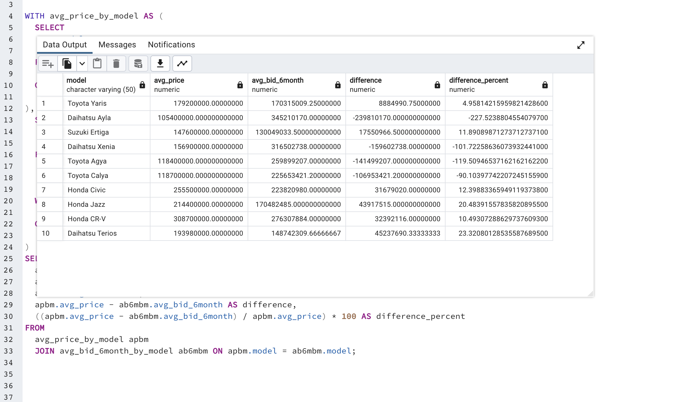
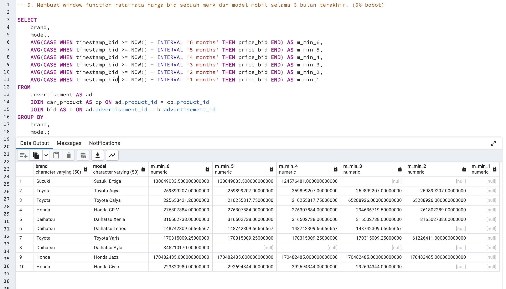
